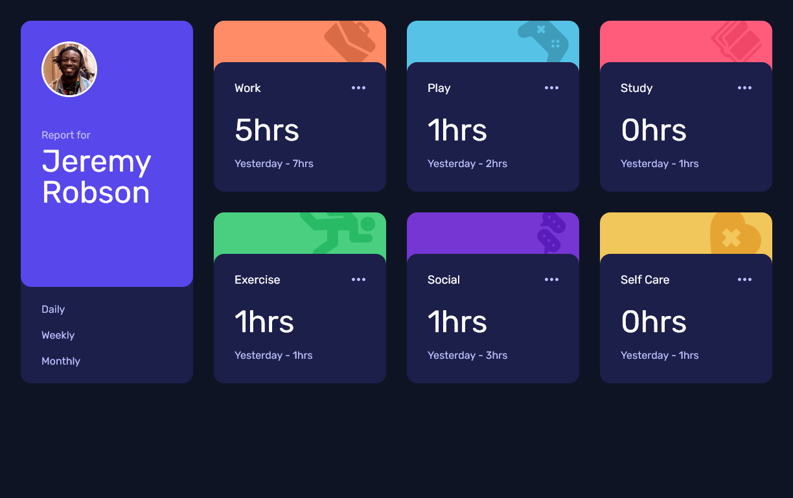
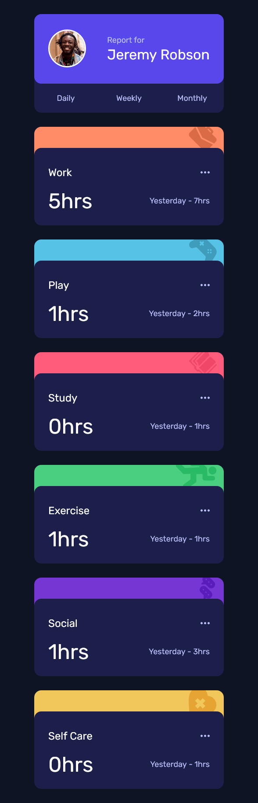

# Frontend Mentor - Time tracking dashboard solution

This is a solution to the [Time tracking dashboard challenge on Frontend Mentor](https://www.frontendmentor.io/challenges/time-tracking-dashboard-UIQ7167Jw). Frontend Mentor challenges help you improve your coding skills by building realistic projects.

Please see the solution folder for the solution.

## Table of contents

- [Overview](#overview)
  - [The challenge](#the-challenge)
  - [Screenshot](#screenshot)
- [My process](#my-process)
  - [Built with](#built-with)
  - [What I learned](#what-i-learned)
  - [Continued development](#continued-development)

## Overview

### The challenge

Users should be able to:

- View the optimal layout for the site depending on their device's screen size
- See hover states for all interactive elements on the page
- Switch between viewing Daily, Weekly, and Monthly stats

### Screenshot

## My process

### Built with

- [Astro](https://astro.build/) - Framework
- [React](https://reactjs.org/) - JS library
- [Nanostores](https://github.com/nanostores/nanostores) - State Management

- Flexbox
- CSS Grid
- Mobile-first workflow

### What I learned

For this project, I learned basic state management in Astro using their recommended library: Nanostores.

I learned how to use Nanostores between Astro components and React components.

I also reinforced my knowledge of CSS flexbox + grid, and using a mobile first layout.

### Continued development

I retrieved data for this project from local JSON. For future projects, I would like to set up a backend + database to store and fetch data instead.

I am thinking an easier option (headless CMS), or possibly a more involved option (express server + ORM).
